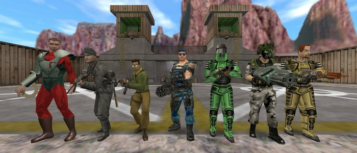

# GoldSrc.one summer contest 2026

**Competition period:** July 1 -- August 31, 2026

**Categories:** mapping, moviemaking

**Prizes in each category:** 🥇 1st: \$50 🥈 2nd: \$30 🥉 3rd: \$20

## Mapping contest

Create a map designed for the [GoldSrc.one crossplay server](https://goldsrc.one/).

### Rules
 - The map must be new, without prior public release
 - One entry per competitor (more people or a team can be credited, but only one gets the prize)
 - The source file must be provided (for verification purposes, won't be published)
 - The map must run on the server on its current configuration (hl+op4+dmc+cs+tfc+dod)
 - By submitting the map, you give license to redistribute the map (with the attribution of the map's author)
   - That means it could be put on the public GoldSrc.one server and people could download it

### Recommendations
 - The map should fit the HL/CS/... vibe
 - The map should be well compiled
 - The use of AI should be disclosed
 - You should make some screenshots of the map with some brief text (or a video)

### Specifics

Creating maps for the crossplay has some caveats.

First, the map must fall into one of the games.
If you make a CS map, CS gamerules will apply.
If you make a HL map, it will be a HL deathmatch map.

You are also a bit limited in the number of used models.
It is quite hard to quantify how much of what can you use exactly.
But if you take a look at the server's maplist, you will get an idea.
For example, we can run dod_charlie no problem. But we cannot run de_vegas nor de_inferno_cz.

There is also a limit on the number of used sounds, but that isn't usually a problem.

There are also some benefits. You can use entities from the other games. For example you can make a CS map and put a HL monster in.
You just need to change its classname from monster_zombie to valve/monster_zombie.

To test the map properly you will need to get the [server installer](#server-installer).

Join [the Discord](https://discord.goldsrc.one/) so we can share the mapping knowledge.

## Moviemaking contest

Create a video related to the [GoldSrc.one crossplay project](https://goldsrc.one/). Could be a fragmovie, could be a trailer, anything audiovisual.

### Rules

 - The video must be new, without prior public release
 - One entry per competitor (more people or a team can be credited, but only one gets the prize)
 - By submitting the video, you give license to redistribute the video (with the attribution of the video's author)
   - That means it could be put on the GoldSrc.one YouTube channel

### Recommendations
 - The use of AI should be disclosed

### Specifics

To record a server-wide demo via a HLTV you need to pick a port to connect to.
If you connect to a cstrike port, you will record a demo that can be played and rendered only in CS.

You will see the player from other games, but first-person spectate will miss the weapons.
So if you want to have a HLTV demo where you can spectate HL players and see their weapons, you need to connect your HLTV to a HL port and record a demo there.

Also on [the Discord](https://discord.goldsrc.one/) there is a \#hlds-relay channel where a bot uploads hltv recorded demos, you can use them (in CS).

If you want to record a play with your friends or something fun with bots, you can get the [server installer](#server-installer) to have your own local crossplay server.

## Entry submission, Judging, Prizes and payout

The how-to submit your entry will be specified later.

After August 31st the contest will be closed and the entries will be judged.

Entries may be disqualified in case of a rule violation or other dishonesty.

The author of the best map will get \$50, the second best will get \$30, the third \$20.

The author of the best video will get \$50, the second best will get \$30, the third \$20.

All entries will be published on a GoldSrc.one website (probably this page).

I will try hard to get the money to you. The best option for me is PayPal, but we can try crypto, gift cards, whatever will get the funds to you.

## Server installer

If you don't have access to the server installer yet, for the purposes of this contest you can get the Installer here:

[GoldSrcOne-CrossPlay-Installer-v12.exe](GoldSrcOne-CrossPlay-Installer-v12.exe)

[There is a video about the Installer](https://www.youtube.com/watch?v=WSuvD9zUQoY). There were major changes since, but the main idea should still hold.

If you would like to edit some of the amxx scripts, contact me and I will give you access to the scripting repository.

## Contact

If you have any questions, there is a \#contest channel on [the Discord](https://discord.goldsrc.one/)

Or send me an email to info@goldsrc.one
